
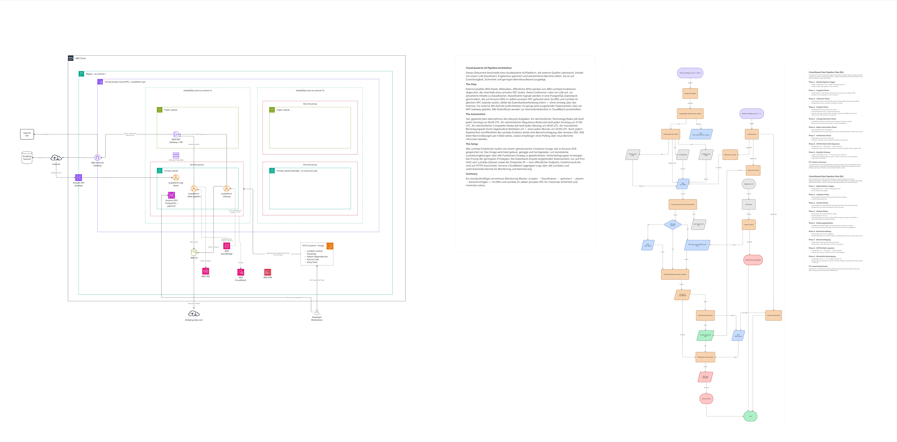
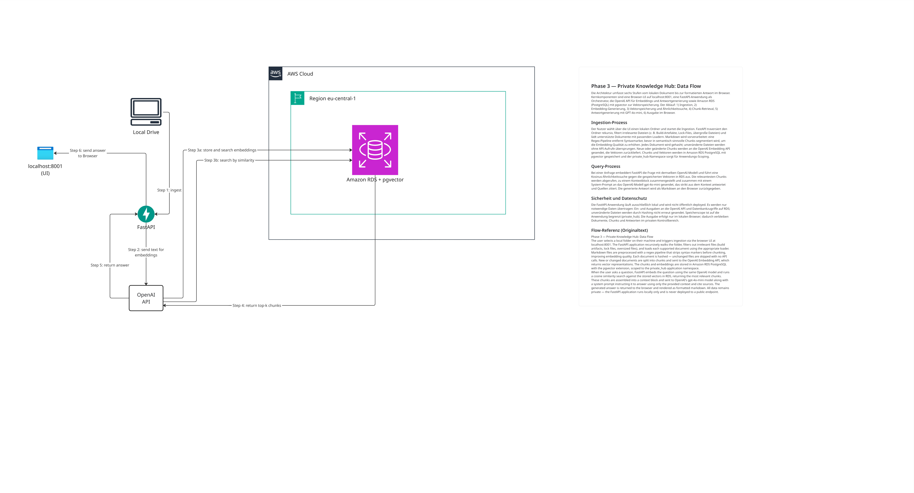
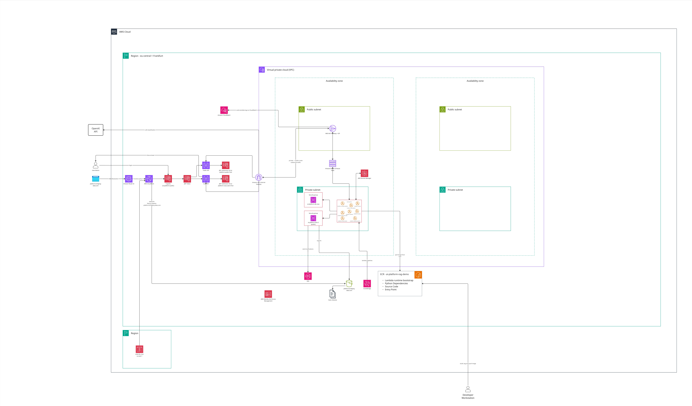

# AI Knowledge Platform

[](https://github.com/Lu13aws/ai-platform-project-v1/actions/workflows/tests.yml)

> **Personal portfolio project.** Built and operated by one person on a personal AWS account as a hands-on reference for AI and data engineering. The compliance documents in [`/compliance`](compliance/) (NIST AI RMF, GDPR/DSG and AWS Well-Architected mappings, including coverage percentages) are **self-assessments**, not audits or certifications. Resource identifiers such as `<AWS_ACCOUNT_ID>` or `<API_ID>` are placeholders; replace them with your own values (see `.env.example`).
>
> **In 60 seconds:** scheduled Lambda agents collect public signals for three radars (technology, competitors, regulation), classify them with an LLM, store them in PostgreSQL + pgvector and answer questions with cited sources (single-pass RAG). A corporate prototype adds Cognito-based RBAC and an audit log. The public demo caps AI questions at 150 per day to keep costs bounded. Live: [platform.bridging-data.com](https://platform.bridging-data.com).

## Project Description

Modular AI knowledge platform built on AWS using PostgreSQL + pgvector, FastAPI, and OpenAI / Anthropic LLMs.
The system ingests structured and unstructured documents, chunks and embeds them, and retrieves grounded answers with source references in response to natural language questions.
Designed as a reusable foundation for multiple applications — RAG demo, technology radar, regulatory radar, competitor radar, private knowledge hub, and a corporate LLM prototype — all sharing the same ingestion, retrieval, and agent infrastructure.

**Live:** [platform.bridging-data.com](https://platform.bridging-data.com) — full Knowledge Platform with Cognito login (self-registration), Technology Radar, Competitor Intelligence, Regulatory Radar, AI Chat, Skills Hub, and Corporate Chat (Phase 6).

---

## Project Structure

```
ai-platform-project-v1/
├── aiplatform/             # Shared platform library (installable Python package)
│   ├── settings.py         # Pydantic BaseSettings — single source of truth for config
│   ├── llm/                # LLM provider abstraction (OpenAI + Anthropic, swappable)
│   ├── storage/            # SQLAlchemy models, async DB engine, S3 wrapper, radar models
│   ├── ingestion/          # Document loaders, chunker, deduplication (hash-based)
│   ├── retrieval/          # Embedder, pgvector search, hybrid retriever
│   ├── storage/            # SQLAlchemy models: models.py, radar_models.py, competitor_models.py,
│   │                       # regulatory_models.py, content_models.py (linkedin_posts + status)
│   └── agents/             # CollectorAgent, AnalyzerAgent, ChangeDetectionAgent,
│                           # ReporterAgent, NotifierAgent, CleanupAgent,
│                           # ReportIndexerAgent (auto-indexes S3 reports into vector store),
│                           # ContentCreatorAgent (LinkedIn draft generation + regenerate),
│                           # LinkedInPublisherAgent (LinkedIn API + Secrets Manager)
├── apps/
│   ├── rag_demo/           # Phase 1 — Public RAG Demo FastAPI application
│   │   ├── api/            # Routes, schemas, radar API endpoints
│   │   ├── services/       # Ingest and query business logic
│   │   └── cli.py          # Click CLI for local ingestion runs
│   ├── radar_pipeline/     # Phase 2 — Weekly Lambda handler (EventBridge trigger, Mon 06:00 UTC)
│   ├── competitor_pipeline/ # Phase 5 — Weekly Lambda handler (Mon 08:00 UTC)
│   ├── regulatory_pipeline/ # Phase 4 — Monthly Lambda handler (1st of month, 07:00 UTC)
│   ├── knowledge_platform/ # Phase 3+ — Knowledge Hub API (skills, ingest-skill, agents, chat)
│   ├── content_creator/    # Content Creator Lambda — weekly draft generation (Thu 09:00 UTC)
│   │   └── lambda_handler.py  # Runs ContentCreatorAgent only; publishing via UI review flow
│   ├── knowledge_platform_ui/ # Phase 5+ — Next.js SPA deployed on platform.bridging-data.com
│   │   ├── src/app/        # Pages: dashboard, chat, reports, agents, skills, linkedin, corp, login
│   │   ├── src/components/ # AppShell (auth guard), Sidebar (corp-admin gated items)
│   │   └── src/lib/        # api.ts, platform-auth.ts (Cognito + group claims), corp-api.ts
│   ├── corp_api/           # Phase 6 — Corporate LLM API (Cognito-protected)
│   │   ├── api/            # Routes (query, ingest, sources, audit, GDPR delete), schemas
│   │   ├── auth/           # Cognito JWT parsing + RBAC (admin / demo_user)
│   │   ├── services/       # corp_service.py — query, ingest, delete, audit log
│   │   └── lambda_handler.py # Mangum adapter + admin_action=setup_schema bootstrap
│   ├── cleanup/            # Phase 2 — Monthly cleanup Lambda (retention enforcement)
│   └── private_hub/        # Phase 3 — Private Knowledge Hub (local only, localhost:8001)
│       ├── main.py         # FastAPI app: ingest, query, sources, stats, delete, UI
│       ├── ingester.py     # FolderIngester: recursive walk, exclusions, 50 MB cap
│       └── static/
│           └── index.html  # Dark-themed single-page UI with markdown rendering
├── compliance/             # Compliance documentation layer (GDPR, NIST AI RMF, AWS WAF)
│   ├── MODEL_CARD.md       # Models in use, versions, limitations, disclaimers
│   ├── ROPA.md             # GDPR Art. 30 Record of Processing Activities (7 activities)
│   ├── PROCESSORS.md       # Art. 28 sub-processor documentation (OpenAI, Anthropic, AWS, LinkedIn)
│   ├── ACCEPTABLE_USE_POLICY.md  # Permitted and prohibited uses
│   ├── INCIDENT_RESPONSE.md      # 72-hour breach notification procedure, severity levels
│   ├── SECURITY_CONTROLS.md      # Evidence map: all controls mapped to NIST / GDPR / AWS WAF
│   ├── DATA_RETENTION.md         # Plain-language retention summary for customer conversations
│   └── AI_LIMITATIONS.md         # Client-facing disclaimer (hallucination, bias, human review)
├── migrations/             # Alembic migrations (shared schema, one history)
│   └── versions/
├── research/               # Architecture decisions, dataset notes, feasibility docs
│   ├── architecture/
│   ├── datasets/
│   └── notes/
├── tests/
│   ├── unit/               # No I/O — runs without Docker
│   ├── integration/        # Requires Docker (make dev-up + make migrate)
│   └── e2e/                # Full stack tests
├── docker/
│   └── postgres/
│       └── init.sql        # Enables pgvector and uuid-ossp extensions
├── docker-compose.yml      # Local PostgreSQL 16 + pgvector
├── alembic.ini
├── pyproject.toml          # uv package manager, all dependencies
├── Makefile                # Dev commands (see Quick Start)
└── .env.example            # All required environment variables (no values)
```

---

## Final Architecture

### Diagramms Phase 1 - Public RAG Demo



Interactive board: https://miro.com/app/board/uXjVHErgZ40=/?moveToWidget=3458764675722816283&cot=14 · https://miro.com/app/board/uXjVHErgZ40=/?moveToWidget=3458764675724444499&cot=14

### Diagramms Phase 2 - Technology Radar



Interactive board: https://miro.com/app/board/uXjVHErgZ40=/?moveToWidget=3458764676069211957&cot=14

### Diagramms Phase 3 - Private Knowledge Hub



Interactive board: https://miro.com/app/board/uXjVHErgZ40=/?moveToWidget=3458764675971998867&cot=14

### Diagramms Phase 6 - Corporate LLM AI Knowledge Platform



Interactive board: https://miro.com/app/board/uXjVHErgZ40=/?moveToWidget=3458764676201009164&cot=14

```
Client (bridging-data.com / CLI)
→ AWS API Gateway
→ FastAPI (AWS Lambda or ECS)
→ Amazon RDS PostgreSQL + pgvector
→ Amazon S3 (raw documents)
→ Amazon CloudWatch (logs + monitoring)
→ AWS Budgets (cost alerts)
```

**Technologies:**

| Layer | Technology |
|---|---|
| Backend API | FastAPI + Uvicorn |
| Language | Python 3.12 |
| Package manager | uv |
| ORM | SQLAlchemy 2.x async + Alembic |
| Vector storage | PostgreSQL 16 + pgvector (HNSW index) |
| Document storage | Amazon S3 |
| Embeddings | OpenAI text-embedding-3-small |
| LLM (chat) | OpenAI gpt-4o-mini / Anthropic Claude (swappable) |
| Chunking | langchain-text-splitters RecursiveCharacterTextSplitter |
| Document loaders | pdfplumber (PDF), python-docx, beautifulsoup4, lxml, openpyxl — 18 formats: PDF, DOCX, TXT, MD, HTML, CSV, JSON, XLSX, PY, TS, JS, SQL, YAML, TOML, SH, TF |
| Infrastructure | AWS Lambda or ECS, RDS, API Gateway, CloudFront |
| CI/CD | GitHub Actions |
| Local dev | Docker Compose (pgvector/pgvector:pg16) |

---

## Final Data Flow

**Ingestion:**

```
Source Document (PDF / DOCX / TXT / MD / HTML / CSV / JSON)
→ Document Loader (aiplatform/ingestion/loaders.py)
→ SHA-256 Hash Check (skip unchanged documents)
→ Text Chunker (RecursiveCharacterTextSplitter, 800 tokens, 100 overlap)
→ Batch Embedder (OpenAI text-embedding-3-small)
→ PostgreSQL: documents + chunks + embeddings tables
→ Amazon S3 (raw document archive)
```

**Query / Retrieval:**

```
User Question
→ Query Embedder (same model as ingestion)
→ pgvector Cosine Similarity Search (HNSW index, top-k chunks)
→ Context Builder (chunks + source labels)
→ LLM Prompt (system prompt + context + question)
→ OpenAI gpt-4o-mini / Anthropic Claude
→ Grounded Answer + Source References
→ FastAPI JSON Response
→ Portfolio Widget (bridging-data.com/ai-demo)
```

---

## Service Setup

### PostgreSQL + pgvector (Local)

```bash
make dev-up         # starts pgvector/pgvector:pg16 on port 5432
make migrate        # runs Alembic migrations (creates documents, chunks, embeddings tables)
make db-shell       # opens psql shell
```

The `docker/postgres/init.sql` script enables the `vector` and `uuid-ossp` extensions on first container start. No manual setup required.

### PostgreSQL + pgvector (AWS RDS)

- Engine: PostgreSQL 16 with `pgvector` extension
- Instance: `db.t3.micro`, eu-central-1 (about 18 USD per month per instance; not covered by the free tier)
- Identifier: `ai-platform-db-v2`
- Endpoint: `<RDS_ENDPOINT>:5432`
- VPC: `ai-platform-vpc` (private subnets — no public endpoint)
- Security group: `<SECURITY_GROUP_ID>` — port 5432 from the Lambda security group only
- Enable extensions on fresh RDS: `uv run python scripts/enable_extensions.py`
- Run migrations against RDS: `uv run alembic upgrade head`

> **Note:** RDS was migrated from the default VPC to `ai-platform-vpc` on 2026-06-20.
> Lambda → RDS connections now stay within the private VPC network (no NAT Gateway roundtrip).
> Local connections to RDS are no longer possible directly — use Lambda invoke or AWS SSM to connect.

### Amazon S3

- Bucket: `ai-platform-documents-{env}`
- Structure: `raw/{app_name}/{document_id}/`
- Access: IAM role with `s3:GetObject`, `s3:PutObject`, `s3:DeleteObject`

### AWS Lambda + API Gateway (live)

- **Public API:** `https://<API_ID>.execute-api.eu-central-1.amazonaws.com`
  - Health: `GET /health`
  - Docs: `GET /docs`
  - Query: `POST /api/v1/query`
  - Ingest: `POST /api/v1/ingest`
  - Radar entries: `GET /api/v1/radar/entries?category=Adopt`
  - Latest radar report: `GET /api/v1/radar/report/latest`
  - CORS: `https://bridging-data.com`, `https://platform.bridging-data.com`

- **Corporate API (Phase 6):** `https://<CORP_API_ID>.execute-api.eu-central-1.amazonaws.com`
  - All routes require `Authorization: Bearer <Cognito JWT>` (ai-platform-corp user pool)
  - Health: `GET /api/v1/corp/health`
  - Auth check: `GET /api/v1/corp/health/auth`
  - Query (RAG): `POST /api/v1/corp/query`
  - Ingest (admin): `POST /api/v1/corp/ingest`
  - Sources: `GET /api/v1/corp/sources`
  - GDPR erasure (admin): `DELETE /api/v1/corp/documents/{id}`
  - Audit log (admin): `GET /api/v1/corp/audit`
  - CORS: `https://platform.bridging-data.com`

- **Frontend (Phase 5+):** `https://platform.bridging-data.com`
  - CloudFront → S3 static export (Next.js)
  - Cognito User Pool `ai-platform-public` — self-registration + email verification
  - **Single Cognito pool** with `corp-admins` group for RBAC — LinkedIn Review + Corp Chat gated behind group membership (frontend guard + backend JWT check)
  - GitHub Actions auto-deploy on push to `main` (changes in `apps/knowledge_platform_ui/`)

- Lambda (RAG demo + KP): `ai-platform-rag-demo`, 512 MB, 60s timeout, container image
- Lambda (corp API): `ai-platform-corp-api`, 512 MB, 60s timeout, container image
- Lambda (content creator): `ai-platform-content-creator`, 512 MB, 300s timeout, Tuesday 08:30 UTC
- Lambda (radar pipeline): `ai-platform-radar-pipeline`, 512 MB, 300s timeout, Monday 06:00 UTC
- Lambda (competitor pipeline): `ai-platform-competitor-pipeline`, 512 MB, 300s timeout, Monday 08:00 UTC
- Lambda (regulatory pipeline): `ai-platform-regulatory-pipeline`, 512 MB, 300s timeout, 1st of month 07:00 UTC
- Lambda (cleanup): `ai-platform-cleanup`, 256 MB, 120s timeout, 1st of month 03:00 UTC
- ECR: `<AWS_ACCOUNT_ID>.dkr.ecr.eu-central-1.amazonaws.com/ai-platform-rag-demo:lambda`

**Redeploy after code changes (all functions share the same image):**

> **Important:** Docker build cache on Windows can produce the same ECR layer digest even after code changes.
> Use a timestamp tag to force ECR to accept new layers, then deploy with the pinned digest.

```bash
# 1. Build without cache
docker build --no-cache -f Dockerfile.lambda -t ai-platform-rag-demo:lambda .

# 2. Verify new code is in the local image
docker run --rm --entrypoint python ai-platform-rag-demo:lambda -c \
  "from aiplatform.agents.report_indexer import ReportIndexerAgent; print('ok')"

# 3. Push with timestamp tag (avoids ECR dedup of unchanged lambda tag)
$ts = Get-Date -Format "yyyyMMddHHmm"
docker tag ai-platform-rag-demo:lambda <AWS_ACCOUNT_ID>.dkr.ecr.eu-central-1.amazonaws.com/ai-platform-rag-demo:lambda-$ts
docker push <AWS_ACCOUNT_ID>.dkr.ecr.eu-central-1.amazonaws.com/ai-platform-rag-demo:lambda-$ts

# 4. Update all Lambda functions with the pinned digest
$digest = (aws ecr describe-images --repository-name ai-platform-rag-demo --image-ids imageTag=lambda-$ts --query "imageDetails[0].imageDigest" --output text)
$ecr = "<AWS_ACCOUNT_ID>.dkr.ecr.eu-central-1.amazonaws.com/ai-platform-rag-demo@$digest"
aws lambda update-function-code --function-name ai-platform-rag-demo             --image-uri $ecr --region eu-central-1
aws lambda update-function-code --function-name ai-platform-radar-pipeline        --image-uri $ecr --region eu-central-1
aws lambda update-function-code --function-name ai-platform-competitor-pipeline   --image-uri $ecr --region eu-central-1
aws lambda update-function-code --function-name ai-platform-regulatory-pipeline   --image-uri $ecr --region eu-central-1
aws lambda update-function-code --function-name ai-platform-cleanup               --image-uri $ecr --region eu-central-1

# 5. Update the lambda tag to point to the new image
docker tag ai-platform-rag-demo:lambda <AWS_ACCOUNT_ID>.dkr.ecr.eu-central-1.amazonaws.com/ai-platform-rag-demo:lambda
docker push <AWS_ACCOUNT_ID>.dkr.ecr.eu-central-1.amazonaws.com/ai-platform-rag-demo:lambda

uv run python scripts/deploy_lambda.py            # updates RAG demo env vars / config
```

---

## Environment Setup

Copy `.env.example` to `.env` and fill in the required values.

**Required variables:**

```
DATABASE_URL              postgresql+asyncpg connection string (asyncpg driver required)
ALEMBIC_DATABASE_URL      postgresql:// connection string (psycopg2, for Alembic only)
OPENAI_API_KEY            sk-...
ANTHROPIC_API_KEY         sk-ant-...
LLM_PROVIDER              openai | anthropic
AWS_REGION                eu-central-1
AWS_ACCESS_KEY_ID
AWS_SECRET_ACCESS_KEY
S3_BUCKET_NAME
```

**Quick Start (local development):**

```bash
pip install uv
uv sync                         # install all dependencies into .venv
cp .env.example .env            # fill in API keys
make dev-up                     # start PostgreSQL
make migrate                    # create schema
make env-check                  # verify settings load
make run-rag-demo               # start API on :8000 (hot reload)
```

**Seed demo documents (downloads 3 public PDFs and ingests them):**

```bash
uv run python scripts/seed_rag_demo.py
```

**Query via CLI:**

```bash
rag-demo query "What are the pillars of the AWS Well-Architected Framework?"
```

**Run tests:**

```bash
make test-unit          # 36 tests, no Docker required
make test-integration   # requires make dev-up + make migrate
```

**Code quality:**

```bash
make lint               # ruff check
make format             # ruff format + auto-fix
make type-check         # mypy
```

---

## Data Sources

**Phase 1 — Public RAG Demo:**

| Source | Format | Notes |
|---|---|---|
| AWS Whitepapers | PDF | Public, no license restrictions |
| NIST Frameworks | PDF | US government public domain |
| OWASP Documentation | PDF / HTML | Open source, CC license |
| Data Governance Guides | PDF | Public |

All sources are public documents. No personal or confidential data is used in Phase 1.

**Phase 2 — Technology Radar:**

| Source | Type | URL |
|---|---|---|
| AWS | RSS + HTML | aws.amazon.com/blogs/aws/ |
| Databricks | HTML | databricks.com/blog |
| Anthropic | HTML | anthropic.com/news |

Sources are seeded via `scripts/seed_radar_sources.py`. New sources can be added to the `radar_sources` table.

---

## AWS Budget

Current setting (2026-09-26): one monthly AWS budget of 50 USD with e-mail alerts at 85 % and 100 % of actual spend and at 100 % of forecast spend. The real run rate is about 96 USD per month (August 2026 including tax), so this budget is already exceeded and needs re-basing. The LLM provider account has a separate 10 USD monthly hard limit.

Track: RDS storage, S3 storage, Lambda/ECS compute, LLM API usage, embedding API usage, API Gateway calls, CloudWatch logs.

---

## Cost Controls

- **Deduplication:** SHA-256 hash on document content — unchanged documents are never re-embedded
- **Chunking cap:** `MAX_CHUNKS_PER_DOC=1000` — prevents runaway costs on large documents
- **LLM cap:** `MAX_LLM_CALLS_PER_RUN=100` per run
- **Embedding cap:** `MAX_EMBEDDING_CALLS_PER_RUN=1000` per run
- **Retention:** Raw articles and raw pages 30 days, embeddings kept until source changes, logs 30 days (configured on all CloudWatch log groups)
- **Model selection:** `gpt-4o-mini` (chat) + `text-embedding-3-small` (embeddings) for cost efficiency

---

## Challenges & Fixes

### Package Named `platform` Shadowed Python stdlib

**Symptom:** After installing the project with `uv sync`, `import platform` resolved to our package instead of Python's standard library `platform` module. This silently broke pydantic, SQLAlchemy, uvicorn, and other dependencies.

**Root cause:** The shared library was initially named `platform/` — identical to Python's built-in `platform` module. When installed into the virtual environment, our package took precedence over the stdlib.

**Fix:**
Renamed `platform/` → `aiplatform/` and updated all imports with:
```bash
grep -rl "from platform\." --include="*.py" . | xargs sed -i 's/from platform\./from aiplatform./g'
```
Updated `pyproject.toml` (`packages`, `src`, `coverage.source`) and `Makefile` (ruff, mypy targets) to reference `aiplatform/`.

---

## Lessons Learned

- Naming a Python package the same as a stdlib module (e.g., `platform`, `json`, `typing`) silently breaks third-party dependencies — always check stdlib name collisions before naming packages
- Alembic requires a **synchronous** database driver (`psycopg2`); the async driver (`asyncpg`) used by SQLAlchemy/FastAPI breaks Alembic's `env.py` — keep two separate connection strings in settings
- `pgvector/pgvector:pg16` Docker image ships with pgvector pre-built; no compilation or manual extension setup required — use it instead of plain `postgres:16`
- HNSW index in pgvector requires no training phase (unlike IVFFlat) — works immediately from the first inserted row, making it the right choice for a dev/demo environment
- `SecretStr` in Pydantic v2 masks secrets in `repr()` and logs automatically — use it for all API keys and credentials
- `@lru_cache` on the settings factory (`get_settings()`) means tests must call `get_settings.cache_clear()` after patching env vars; otherwise they pick up the cached dev settings
- `asyncpg` cannot accept `None` as a SQL parameter when the type is ambiguous — build the SQL fragment conditionally and only add the parameter when it is not `None`
- OpenAI's embedding API has a hard limit of 300,000 tokens per request — batch large document sets into sub-batches of ≤100 chunks to stay within limits
- The default similarity threshold of 0.75 is too strict for `text-embedding-3-small` on short documents — 0.5 is a more practical starting point for semantic retrieval
- Windows `Out-File` defaults to UTF-16 LE; use `-Encoding utf8` explicitly when creating test files that Python will later read as UTF-8
- Long-running DB transactions during HTTP fetches cause silent commit failures — always separate the fetch phase (no session) from the save phase (short session with `flush()` per source)
- Multiple Lambda functions can share one ECR image using `ImageConfig.Command` override per function — no separate Dockerfiles needed
- `AWS_REGION`, `AWS_ACCESS_KEY_ID`, and `AWS_SECRET_ACCESS_KEY` are reserved Lambda env vars — passing them explicitly causes `InvalidParameterValueException`; Lambda injects them automatically from the IAM role
- `asyncio.run()` is valid in Lambda (each invocation is a fresh process) but must never be used inside FastAPI handlers — use `async def` endpoints there
- Adding sentiment to an existing LLM classification prompt costs nothing extra — extend the JSON response template in the same call
- SNS `create_topic()` is idempotent; `add_permission()` on Lambda raises `ResourceConflictException` on re-deploy — always catch and continue
- A snapshot pattern (`UPDATE table SET previous_column = current_column`) before each pipeline run enables cheap change detection: `NULL` previous value means new entry, differing values mean movement
- asyncpg connections are bound to the event loop that created them — on warm Lambda container reuse, `asyncio.run()` creates a new loop and old connections raise "Future attached to different loop"; fix: `await engine.dispose()` in `try/finally` INSIDE the same `asyncio.run()` call (not in an outer `finally`)
- Docker build cache on Windows (Docker Desktop + WSL2) can produce identical ECR layer digests even after Python file changes; fix: push with a timestamp tag (`lambda-YYYYMMDDHHMM`) to bypass ECR deduplication, then deploy Lambdas using the pinned `@sha256:...` digest
- When a pipeline has multiple phases sharing a DB session, an error in one phase (e.g. `UniqueViolationError`) rolls back the transaction and leaves the session in `PendingRollbackError` state — subsequent phases that try to use the same session will fail silently; fix: each phase and each agent opens its own `async with get_async_session()` context
- Content-hash dedup must check BOTH `source_uri` AND `content_hash` — pipelines that run with no new data generate identical report content under a new timestamped S3 key; without the content-hash check this hits the UNIQUE constraint and corrupts the pipeline session
- Pipeline-integrated agents (like a report indexer) should always catch all exceptions and return an error string instead of raising — a non-critical phase should never fail the whole pipeline

---

## Competitor Radar — Operations Guide

> This section documents how the Competitor Radar pipeline works and how to maintain it.
> It is intentionally detailed so it can be ingested into the Private Knowledge Hub
> and queried later: *"How do I add a new company to the Competitor Radar?"*

### Pipeline Overview

The Competitor Radar runs every **Monday at 08:00 UTC** via AWS Lambda + EventBridge.

```
Phase 1: CompetitorCollectorAgent   — fetch articles, pricing diffs, stock moves, HN posts
Phase 2: CompetitorAnalyzerAgent    — LLM classifies each article (signal type, impact, sentiment)
Phase 3: CompetitorReporterAgent    — HTML + JSON report → S3, also writes latest.html
Phase 4: CompetitorNotifierAgent    — SNS email notification
```

Each phase runs in its own DB session. Failures in later phases do not roll back earlier work.

---

### Companies & Sources

| Company | Blog / RSS | Pricing | Financial | Community (HN) |
|---|---|---|---|---|
| OpenAI | openai.com/blog/rss.xml | openai.com/api/pricing ⚠️ 403 | — | `hn://OpenAI` |
| Anthropic | anthropic.com/news | anthropic.com/pricing | — | `hn://Anthropic` |
| Microsoft | azure.microsoft.com/blog/feed/ | azure.microsoft.com/en-us/pricing/... | MSFT | `hn://Microsoft Copilot` |
| AWS | aws.amazon.com/blogs/machine-learning/feed/ | aws.amazon.com/bedrock/pricing/ | AMZN | `hn://Amazon Bedrock` |
| Google | cloud.google.com/blog/products/ai-machine-learning/rss/ | cloud.google.com/vertex-ai/... | GOOGL | `hn://Google Gemini` |
| Mistral AI | mistral.ai/news | mistral.ai/technology | — | `hn://Mistral AI` |

⚠️ OpenAI pricing page returns 403 — no workaround without authentication. Monitor manually.

**URL schemes used in the DB:**
- `https://...` — real URL for blog feeds and pricing pages
- `yahoo://TICKER` — financial source (collector strips prefix, queries Yahoo Finance)
- `hn://keyword` — HN Algolia search term (collector strips prefix, searches HN)

---

### Signal Types

| signal_type | Source | LLM? | Trigger |
|---|---|---|---|
| `product_announcement` | blog, community | Yes | Classified by LLM |
| `pricing_change` | pricing | **No** | HTML hash differs from last fetch |
| `financial_update` | financial | **No** | Weekly stock move > 5% |
| `sentiment_event` | blog, community | Yes | Classified by LLM |

---

### Adding a New Company

1. Add source rows to the DB (or add to `scripts/seed_competitor_sources.py` and re-run):

```python
# For a blog:
CompetitorSource(company_name="New Co", name="New Co Blog",
    url="https://newco.com/rss.xml", source_type="blog", active=True)

# For a pricing page:
CompetitorSource(company_name="New Co", name="New Co Pricing",
    url="https://newco.com/pricing", source_type="pricing", active=True)

# For a public company stock:
CompetitorSource(company_name="New Co", name="NCO Stock",
    url="yahoo://NCO", source_type="financial", active=True)

# For HN community sentiment:
CompetitorSource(company_name="New Co", name="HN: New Co",
    url="hn://New Company", source_type="community", active=True)
```

2. Next Monday's run will pick up the new sources automatically.

---

### Disabling a Source

Set `active=False` on the source row to stop collecting from it without deleting the signal history:

```sql
UPDATE competitor_sources SET active = false WHERE name = 'OpenAI Pricing';
```

---

### Manually Triggering a Run

```bash
aws lambda invoke \
  --function-name ai-platform-competitor-pipeline \
  --region eu-central-1 \
  /tmp/competitor_out.json && cat /tmp/competitor_out.json
```

---

### S3 Structure

```
s3://ai-platform-documents-dev/
└── competitor/
    ├── raw/YYYY/MM/{company-slug}/{hash}.html   ← pricing page HTML snapshots
    └── reports/
        ├── YYYY/MM/competitor_YYYYMMDD_HHMMSS.html  ← timestamped report
        ├── YYYY/MM/competitor_YYYYMMDD_HHMMSS.json  ← timestamped JSON
        ├── latest.html                              ← always the most recent run
        └── latest.json                              ← always the most recent run
```

`latest.html` and `latest.json` are overwritten on every run — used for stable portfolio embedding.

---

### Retention Rules

| Data | Retention | Mechanism |
|---|---|---|
| `competitor_raw_content` | 30 days | `expires_at` column → `CleanupAgent` (monthly Lambda) |
| `competitor_signals` | 12 months | `expires_at` column → `CleanupAgent` |
| `competitor_reports` (DB + S3) | 12 months | `generated_at` cutoff → `CleanupAgent` |
| S3 pricing snapshots (`raw/`) | 30 days | Same as raw content |

---

### Lambda & EventBridge Details

| Property | Value |
|---|---|
| Function name | `ai-platform-competitor-pipeline` |
| ECR image | `ai-platform-rag-demo:lambda` (shared image) |
| Handler | `apps.competitor_pipeline.lambda_handler.handler` |
| Schedule | `cron(0 8 ? * MON *)` — Monday 08:00 UTC |
| Timeout | 300s |
| Memory | 512 MB |
| VPC | Private subnets (RDS access required) |

Re-deploy after code changes:

```bash
# 1. Rebuild and push the Docker image
uv run python scripts/build_and_push.py

# 2. Update the Lambda function
uv run python scripts/deploy_competitor_pipeline.py
```

---

## Regulatory Radar — Operations Guide

> This section documents how the Regulatory Radar pipeline works and how to maintain it.
> It is intentionally detailed so it can be ingested into the Private Knowledge Hub
> and queried later: *"How do I update the EU AI Act in the Regulatory Radar?"*

### How the Pipeline Works

The Regulatory Radar runs automatically on the **1st of every month at 07:00 UTC** via AWS EventBridge + Lambda. It runs in 4 phases:

```
1. Collector   — fetches each active source URL, extracts text, computes SHA-256 hash
                 → if hash changed: uploads raw file to S3, inserts RegulatoryDocument record
                 → if unchanged: skips (zero cost)

2. Analyzer    — for each unanalyzed RegulatoryDocument (is_latest=True, no change record yet):
                 → diffs previous vs new version text (difflib, max 3,000 chars sent to LLM)
                 → LLM classifies: impact_level (High/Medium/Low), category (Privacy/AI/Cybersecurity/Compliance)
                 → inserts RegulatoryChange record

3. Reporter    — loads all RegulatoryChanges not yet linked to a report
                 → generates JSON + dark-themed HTML report
                 → uploads to S3: regulatory/reports/YYYY/MM/regulatory_YYYYMMDD_HHMMSS.{json,html}
                 → inserts RegulatoryReport record, links changes via report_id FK

4. Notifier    — sends SNS email summary (subject: "N changes detected | M sources monitored")
```

### Monitored Sources

| Source | Type | How monitored |
|---|---|---|
| NIST Cybersecurity Framework 2.0 | PDF | Auto — fetched from nvlpubs.nist.gov monthly |
| OWASP Top 10 | HTML | Auto — fetched from owasp.org monthly |
| FINMA Risk Monitor (index page) | HTML | Auto — detects when new annual report is published |
| EU AI Act | PDF | **Manual** — EUR-Lex blocks automated access |
| GDPR | PDF | **Manual** — EUR-Lex blocks automated access |
| FINMA Risk Monitor 20XX | PDF | **Manual** — annual PDF downloaded manually |

Auto sources: `active=True` in `regulatory_sources` table — collected every month.
Manual sources: `active=False` — excluded from auto-collector, ingested via script (see below).

### How to Update a Manual Source (EU AI Act / GDPR / FINMA Annual PDF)

When a new version is published (e.g. EU AI Act amendment, new FINMA Risk Monitor):

**Step 1 — Download the new PDF manually:**
- EU AI Act: `https://eur-lex.europa.eu/legal-content/DE/TXT/?uri=celex:32024R1689`
- GDPR: `https://eur-lex.europa.eu/legal-content/DE/TXT/?uri=celex:32016R0679`
- FINMA Risk Monitor: `https://www.finma.ch/dokumentation/finma-publikationen/berichte/risikomonitor/`

**Step 2 — Ingest the new PDF into the Regulatory Radar pipeline:**
```bash
uv run python scripts/ingest_regulatory_pdf.py "C:/path/to/EU-AI-Act-2027.pdf" "EU AI Act" "AI"
uv run python scripts/ingest_regulatory_pdf.py "C:/path/to/GDPR-updated.pdf" "GDPR" "Privacy"
uv run python scripts/ingest_regulatory_pdf.py "C:/path/to/FINMA_Risikomonitor_2027.pdf" "FINMA Risk Monitor 2027" "Compliance"
```

The script:
- Extracts text with pdfplumber (handles complex regulatory PDF fonts correctly)
- Computes SHA-256 hash — skips if identical to stored version
- Uploads to S3 under `regulatory/raw/YYYY/MM/<slug>/<hash>.pdf`
- Creates a `RegulatoryDocument` record with `is_latest=True`

**Step 3 — Trigger the pipeline immediately (optional):**
```bash
uv run python -m apps.regulatory_pipeline.lambda_handler
```
Or wait — the Lambda will pick it up automatically on the 1st of next month.

**Step 4 — Also update the Private Knowledge Hub (for Q&A):**
- Open `localhost:8001` → Ingest Folder → paste the path to the new PDF
- The system detects the hash change and re-embeds with the updated content

### S3 Structure

```
ai-platform-documents-dev/
├── regulatory/
│   ├── raw/
│   │   └── YYYY/MM/
│   │       ├── nist-cybersecurity-framework-2-0/<hash>.pdf   ← auto-collected
│   │       ├── owasp-top-10/<hash>.html                      ← auto-collected
│   │       ├── finma-risk-monitor/<hash>.html                ← auto-collected
│   │       ├── eu-ai-act/<hash>.pdf                          ← manually ingested
│   │       └── gdpr/<hash>.pdf                               ← manually ingested
│   └── reports/
│       └── YYYY/MM/
│           ├── regulatory_YYYYMMDD_HHMMSS.json               ← machine-readable
│           └── regulatory_YYYYMMDD_HHMMSS.html               ← human-readable report
```

Raw documents are kept permanently (version history). Reports are retained for 24 months then deleted by the cleanup Lambda.

### Retention Rules

| Data | Retention | Managed by |
|---|---|---|
| `regulatory_documents` (raw versions) | **Permanent** — version history required | Never auto-deleted |
| `regulatory_changes` (diff summaries) | **Permanent** | report_id set to NULL when report deleted, row kept |
| `regulatory_reports` (DB record) | 24 months | Cleanup Lambda (1st of month, 03:00 UTC) |
| S3 raw PDFs/HTML | Permanent | No lifecycle rule |
| S3 report JSON/HTML | 24 months | Cleanup Lambda deletes S3 files before DB row |

### Lambda Functions (Phase 4)

| Function | Trigger | Timeout |
|---|---|---|
| `ai-platform-regulatory-pipeline` | EventBridge: 1st of month, 07:00 UTC | 300s |
| `ai-platform-cleanup` | EventBridge: 1st of month, 03:00 UTC | 120s |

Both use the same ECR image (`ai-platform-rag-demo:lambda`) with different `ImageConfig.Command`.

**Redeploy after code changes:**
```bash
docker build -f Dockerfile.lambda -t ai-platform-rag-demo:lambda .
docker tag ai-platform-rag-demo:lambda <AWS_ACCOUNT_ID>.dkr.ecr.eu-central-1.amazonaws.com/ai-platform-rag-demo:lambda
docker push <AWS_ACCOUNT_ID>.dkr.ecr.eu-central-1.amazonaws.com/ai-platform-rag-demo:lambda
uv run python scripts/deploy_regulatory_pipeline.py
```

### Seed Regulatory Sources (first time setup)

If the `regulatory_sources` table is empty (e.g. after a fresh DB restore):
```bash
uv run python scripts/seed_regulatory_sources.py
```
Then manually re-ingest the EU AI Act, GDPR, and FINMA PDFs using the steps above.

---

## Future Improvements

### Infrastructure
- CDK / Terraform for all AWS resources (currently manual scripts)
- WAF rules for rate limiting at edge
- CloudWatch dashboards for query latency and embedding costs

### Portfolio Integration
- Project card on bridging-data.com linking to platform.bridging-data.com

### Observability
- Structured JSON logging with correlation IDs
- Alerting on LLM error rates and cost thresholds

---

## Project Progress

### 20260630 — Compliance documentation layer + Skills Hub category fix

**Compliance documentation layer (`/compliance`):**
- 8 Markdown documents created — all committed to git, all RAG-indexed into the Knowledge Platform
- `MODEL_CARD.md` — models used (OpenAI text-embedding-3-small, gpt-4o-mini; Anthropic configurable), limitations, disclaimers
- `ROPA.md` — GDPR Art. 30 Record of Processing Activities for all 7 processing activities
- `PROCESSORS.md` — OpenAI, Anthropic, AWS, LinkedIn documented as Art. 28 sub-processors with data flows + SCCs
- `ACCEPTABLE_USE_POLICY.md` — permitted uses, prohibited uses, platform scope
- `INCIDENT_RESPONSE.md` — P1–P4 severity levels, 6-step response procedure, GDPR Art. 33 72-hour notification
- `SECURITY_CONTROLS.md` — evidence table mapping all controls to NIST AI RMF / GDPR / AWS WAF
- `DATA_RETENTION.md` — plain-language summary for customer conversations; cross-links to ROPA.md
- `AI_LIMITATIONS.md` — client-facing disclaimer: hallucination, bias, incomplete context, human review requirements

**RAG indexing:**
- `scripts/ingest_compliance_docs.py` — indexes all `/compliance/*.md` via existing `ingest-skill` endpoint
- SHA-256 dedup: re-running the script is safe (skips unchanged content)
- All 8 docs verified in AI Chat: questions like "what is our data retention policy for competitor signals?" return answers grounded in `skill://compliance/DATA_RETENTION`

**Bug fix — Skills Hub category derivation:**
- `apps/knowledge_platform/services/platform_service.py` — `get_skills()` now reads `doc_metadata["category"]` instead of parsing the source URI path
- Pre-existing bug: all skills were showing `category="other"` because `skill://ai/...` URIs have no "skills" path component to parse
- Fix benefits all 93 indexed documents: `ai (13)`, `aws (25)`, `compliance (8)`, `development (13)`, `radar (7)`, `competitor (7)`, `regulatory (3)`, etc.

**Coverage after this session:**
- NIST AI RMF: ~85% (up from ~70%)
- GDPR / Swiss DSG: ~85% (up from ~75%)
- AWS Well-Architected (Security Pillar): ~85% (unchanged — technical controls already solid)

---

### 20260623 — Phase 6 compliance review + CLAUDE.md / README update

**Completed:**
- `research/phase6/compliance_mapping_v2.md` — post-implementation compliance assessment
  - NIST AI RMF: ~70% coverage (+40% since Phase 6 start)
  - GDPR / Swiss DSG: ~75% coverage (+35%)
  - AWS Well-Architected (Security Pillar): ~85% coverage (+25%)
  - All 5 must-haves confirmed delivered: Cognito auth, separate RDS, RBAC, audit logging, GDPR Art.17 deletion
- `CLAUDE.md` updated — Phase 6 status `🔄 PLANNED → ✅ COMPLETE`; Phase 6 Success Criteria all marked ✅
- `README.md` updated — Content Creator + Corp API Lambda entries added; LinkedIn OAuth Setup moved from Future Improvements (completed)
- Documentation gaps identified (model card, ROPA, AUP, incident response, processors, security controls) — resolved in 20260630 session above

---

### 20260622 — LinkedIn Review UI + Auth consolidation + Security hardening

**LinkedIn Review UI (full pipeline):**
- `ContentCreatorAgent` extended with `regenerate()` — re-runs LLM with same company/domain/angle for one-click refresh in UI
- `LinkedInPost.status` column added (`draft | published | rejected`) via Alembic migration `b3e7f2a1c9d5`; production RDS migrated via Lambda invoke (`{"action": "run_migrations"}`)
- `apps/content_creator/lambda_handler.py` updated — generates draft only, no auto-publish; publishing is manual via the review UI
- Backend: `apps/knowledge_platform/services/linkedin_service.py` — `list_posts`, `edit_post`, `regenerate_post`, `publish_post`, `reject_post`
- Backend: 5 new routes under `/kp/linkedin/` (GET, PATCH, POST /regenerate, POST /publish, DELETE)
- Frontend: `apps/knowledge_platform_ui/src/app/linkedin/page.tsx` — tabbed review UI (Drafts / Published / Rejected / All), inline edit, copy, regenerate, publish, reject actions per post

**Cognito auth consolidation (single pool):**
- Two separate Cognito user pools → one pool (`ai-platform-public`) with `corp-admins` group
- `apps/corp_api/auth/cognito.py` — `is_admin` and `is_demo_user` now both check `"corp-admins" in groups`
- `apps/knowledge_platform_ui/src/lib/platform-auth.ts` — `groups: string[]` stored in localStorage from `cognito:groups` JWT claim; `isCorpAdmin(auth)` helper; `decodeGroups()` decodes base64 JWT payload
- Corp Chat page (`/corp`) rewritten — no separate login form; access granted/denied based on group claim
- `apps/knowledge_platform/api/routes.py` — `/query` + `/sources` require `require_admin` dependency

**Security hardening (LinkedIn endpoints):**
- `_require_corp_admin` FastAPI dependency added to all 5 `/kp/linkedin/*` routes — decodes JWT `cognito:groups` claim, returns 403 if `corp-admins` not present
- Frontend LinkedIn page adds `Authorization: Bearer {idToken}` header to all API calls
- Sidebar: LinkedIn and Corp Chat items hidden for non-admin users (frontend group check)
- Defence-in-depth: two independent layers (frontend guard + backend JWT check)

**Bug fixes:**
- CORS: `platform.bridging-data.com` missing from `_PRODUCTION_ORIGINS` in `apps/rag_demo/main.py` — POST requests (AI Chat, Corp Chat query) failed with `TypeError: Failed to fetch`
- Dashboard: `Promise.all([api.stats(), api.recent()])` failed silently if either call errored — replaced with independent fetches + cleanup flag; removed hardcoded `localhost:8002` hint from error message
- `apps/rag_demo/lambda_handler.py` extended with `{"action": "run_migrations"}` event — runs DDL directly against private VPC RDS when alembic.ini is not available in Lambda image

---

### 20260622 — Phase 6 complete: Corporate LLM Prototype live on platform.bridging-data.com

**Completed:**
- **Corp RDS** (`ai-platform-db-corp`) — separate PostgreSQL + pgvector instance in `ai-platform-vpc`, no public endpoint. Tables: `documents`, `chunks`, `embeddings`, `audit_logs`. To save about 18 USD per month the instance is deleted between demos: `uv run python scripts/corp_db_up.py --execute` restores it from the newest encrypted snapshot in about 6 minutes (endpoint and secrets stay valid, row counts are verified), `scripts/corp_db_down.py --execute` removes it again after taking a final snapshot
- **Corp API Lambda** (`ai-platform-corp-api`) — FastAPI + Mangum, same shared ECR image, handler `apps.corp_api.lambda_handler`
- **Corp API Gateway** (`<CORP_API_ID>`) — HTTP API with Cognito JWT Authorizer (validates against `ai-platform-corp` user pool)
- **RBAC** — `admin` group (ingest + query + audit + delete), `demo_user` group (query only); groups parsed from API Gateway JWT claims (bracket-stripping fix for `"[admin]"` serialization)
- **Ingest endpoint** (`POST /corp/ingest`) — SHA-256 dedup, Chunker → TextChunk objects → OpenAI embeddings → Corp RDS
- **Query endpoint** (`POST /corp/query`) — pgvector similarity search on Corp RDS → OpenAI LLM → grounded answer with sources
- **GDPR Art. 17 deletion** (`DELETE /corp/documents/{id}`) — cascade delete (document → chunks → embeddings) + audit log entry
- **Audit log** (`GET /corp/audit`) — every action logged (ingest, ingest_skip, query, delete) with user_id, email, resource, timestamp; optional `?user_id=` filter
- **Cognito User Pools** — `ai-platform-corp` (admin only) + `ai-platform-public` (self-registration + email verification for platform visitors)
- **Knowledge Platform UI** deployed on `https://platform.bridging-data.com`:
  - Next.js static export → S3 (`platform.bridging-data.com`) → CloudFront → Route 53
  - ACM wildcard cert `*.bridging-data.com` (us-east-1)
  - AppShell auth guard (client-side, localStorage JWT, trailing-slash-normalized path check)
  - Login page: Sign in + Create account + Email verification flow (direct Cognito API, no SDK)
  - Corp Chat page: separate auth against `ai-platform-corp` user pool, Bearer token on all requests
  - GitHub Actions CI/CD: push to `main` with changes in `apps/knowledge_platform_ui/` → auto-deploy
- **Scripts**: `setup_corp_rds.py`, `setup_corp_cognito.py`, `setup_corp_schema.py`, `deploy_corp_api.py`, `setup_platform_cognito.py`, `setup_platform_cloudfront.py`, `test_corp_api.py`
- **Compliance mapping**: `research/phase6/compliance_mapping.md` — NIST AI RMF × GDPR/DSG × AWS WAF

**Key bugs fixed during implementation:**
- `provider.name` → `provider.provider_name.value` (OpenAIProvider attribute)
- `provider.chat()` → `provider.complete(messages=[Message(...)], system_prompt=...)` (correct method + dataclass)
- `TextChunk` objects from `Chunker().split()` are dataclasses, not strings — use `.content`, `.chunk_index`, `.token_count`
- `SearchResult` attributes are `.score` and `.source_uri`, not `.similarity` and `.title`
- API Gateway serializes Cognito groups array as `"[admin]"` string — `_parse_groups()` strips brackets before splitting
- `asyncio.run()` closes event loop — after `setup_schema`, restore with `asyncio.new_event_loop()` + `asyncio.set_event_loop()`
- `trailingSlash: true` in Next.js config makes `/login` → `/login/` — normalize pathname before `PUBLIC_PATHS` check in AppShell
- Login form left-aligned: `AppShell` returned `<>{children}</>` (fragment without width) inside flex body — fixed to `<div className="w-full">`
- `ImageConfig.Command` (not `Handler`) required for container image Lambdas
- `IdentitySource` in JWT Authorizer must be a list, not a string

---

### 20260620 — Phase 5+: Auto-indexer integrated into all pipeline Lambdas

**Completed:**
- `ReportIndexerAgent` (`aiplatform/agents/report_indexer.py`) — new agent that downloads JSON reports from S3, converts them to readable text, and ingests them into the vector store via `ingest_skill`
- **Auto-indexing** added as pipeline Phase 5 in all three pipelines (radar, competitor, regulatory) — runs automatically after each reporter phase, before the notifier
- AI Chat can now answer questions about the latest reports without any manual indexing step
- **Session isolation**: indexer manages its own `async with get_async_session()` — errors never corrupt the pipeline session
- **Content-hash dedup** added to `ingest_skill` — prevents `UniqueViolationError` when identical report content appears under a new timestamped S3 key
- **asyncpg warm-container fix**: all pipeline handlers now call `await engine.dispose()` in `try/finally` at the end of `_run_pipeline()` — prevents "Future attached to different loop" on Lambda warm-container reuse
- **Docker ECR deploy fix**: timestamp tag (`lambda-YYYYMMDDHHMM`) + pinned digest deploy — bypasses ECR layer deduplication that caused stale code to persist after `--no-cache` builds on Windows
- `scripts/ingest_reports.py` — manual backfill script for historical reports (`--latest`, `--dry-run` flags)
- 9 historical reports (3 radar + 3 competitor + 3 regulatory) indexed into vector store

**Verified:**
- Cold start: `status=ok | indexer=skipped` (content unchanged, dedup works)
- Warm start: `status=ok | indexer=ok (6 chunks)` (new S3 key, new content indexed)
- All three pipelines tested successfully with new image digest

---

### 20260619 — Phase 5 complete: Competitor Radar pipeline

**Completed:**
- Weekly Lambda pipeline (`ai-platform-competitor-pipeline`) deployed, fires every Monday at 08:00 UTC
- 4-phase pipeline: Collector → Analyzer → Reporter → Notifier
- `competitor_sources`, `competitor_raw_content`, `competitor_signals`, `competitor_reports` schema (Alembic migration `145530df3842`)
- **CompetitorCollectorAgent** — 4 source types in one agent:
  - *Blog* — RSS/Atom or HTML scraping, ≤15 articles per source, stored as `CompetitorRawContent`
  - *Pricing* — HTML hash-based change detection, direct `CompetitorSignal` on change (no LLM cost)
  - *Financial* — Yahoo Finance public API (no key), weekly % change, signal only if |move| > 5%
  - *Community* — HN Algolia search API (no key), past 7 days, stored as `CompetitorRawContent`
- **CompetitorAnalyzerAgent** — LLM classifies each raw article: `signal_type` (product_announcement/pricing_change/financial_update/sentiment_event), `sentiment`, `impact_level`, relevance filter; `MAX_LLM_CALLS_PER_RUN` hard limit
- **CompetitorReporterAgent** — dark-themed HTML + JSON report grouped by company, sorted High→Low impact, uploaded to `competitor/reports/YYYY/MM/`
- **CompetitorNotifierAgent** — SNS email reusing shared topic
- **CleanupAgent** extended — `competitor_raw_content` 30-day expiry, `competitor_signals` 12-month expiry, `competitor_reports` 12-month retention with S3 cleanup
- 6 companies monitored: OpenAI, Anthropic, Microsoft, AWS, Google, Mistral AI
- 21 sources seeded: 6 blogs, 6 pricing pages, 3 financial (MSFT/AMZN/GOOGL), 6 HN community searches
- First run: 107 articles collected, 76 relevant signals, 5 pricing change signals (initial captures)

**Known limitations:**
- OpenAI pricing page returns 403 — needs alternative URL or manual monitoring
- Financial signals only trigger on >5% weekly move — stocks stable this week, no financial signals
- `MAX_LLM_CALLS_PER_RUN=100` caps analysis per run — remaining 7 articles analyzed next run

---

### 20260619 — Phase 4 complete: Regulatory Radar pipeline live on AWS

**Completed:**
- Monthly Lambda pipeline (`ai-platform-regulatory-pipeline`) deployed, fires 1st of each month at 07:00 UTC
- 4-phase pipeline: Collector → Analyzer → Reporter → Notifier
- `regulatory_sources`, `regulatory_documents`, `regulatory_changes`, `regulatory_reports` schema (Alembic migration `e5a1b3c7d9f2`)
- **RegulatoryCollectorAgent** — two-phase pattern (all HTTP fetches before opening DB session), SHA-256 hash on extracted text, `is_latest` flag per source, S3 upload to `regulatory/raw/YYYY/MM/`
- **RegulatoryAnalyzerAgent** — `difflib.unified_diff` between versions (max 3,000 chars to LLM), impact classification (High/Medium/Low), category tagging (Privacy/AI/Cybersecurity/Compliance), idempotent (skips already-analyzed docs)
- **RegulatoryReporterAgent** — dark-themed HTML + JSON report, uploaded to `regulatory/reports/YYYY/MM/`, changes linked via `report_id` FK with `SET NULL` on delete
- **RegulatoryNotifierAgent** — SNS email reusing Phase 2 topic and IAM role
- **CleanupAgent** extended — 24-month retention on regulatory reports (documents kept permanently)
- `scripts/ingest_regulatory_pdf.py` — manual ingestion for EUR-Lex documents that block automated scraping (EU AI Act, GDPR, FINMA annual PDFs); creates `active=False` source, uploads to S3, inserts RegulatoryDocument for analyzer to pick up
- Switched `PDFLoader` from `pypdf` to `pdfplumber` — fixes broken word spacing in complex regulatory PDFs (`T ransparenz` → `Transparenz`)
- 6 sources monitored: NIST CSF 2.0 + OWASP Top 10 + FINMA index (auto) + EU AI Act + GDPR + FINMA Risk Monitor 2025 (manual)

**Fixed during implementation:**
- `UnicodeEncodeError` on `→` in print statements — Windows PowerShell cp1252 encoding; replaced with ASCII `->`
- `MissingGreenlet` lazy-load after rollback — capture `source.name` before `try` block to avoid expired ORM object access
- EUR-Lex and FINMA URLs block automated access — fallback to `scripts/ingest_regulatory_pdf.py` for manual ingestion
- Reporter showing UUID instead of source name for manual sources — reporter was filtering `active=True` only; fixed to load all sources
- `UniqueViolationError` on `url="manual"` — second manual source hit unique constraint; fixed to use `manual://<slug>` per source

---

### 20260618 — Phase 3 complete: Private Knowledge Hub running locally

**Completed:**
- `apps/private_hub/` — standalone FastAPI application on `localhost:8001`, completely isolated from the public RAG demo
- `FolderIngester` — recursive folder walk with 15 excluded directory patterns, 7 excluded filenames, 50 MB file cap, `IngestResult` dataclass
- Single-file and directory path support: `run()` dispatches to `_ingest_file()` or `_walk()` based on `is_file()` check
- `app_name="private_hub"` scoping — all documents, chunks, and embeddings stored with private hub scope, never returned by public API
- `MarkdownLoader` with `_strip_markdown()` — 13-step regex pipeline strips headers, bold/italic, tables, list markers, blockquotes while preserving all content; registered before `TextLoader` in loader chain
- `similarity_threshold=0.25` for private hub queries — personal markdown documents score 0.23–0.33 vs 0.40+ for prose PDFs; lower threshold required for meaningful retrieval
- 18 supported file types: PDF, DOCX, TXT, MD, HTML, HTM, CSV, JSON, XLSX, PY, TS, JS, SQL, YAML, YML, TOML, SH, TF
- `DELETE /sources/{document_id}` endpoint — cascade deletes chunks and embeddings via ORM relationship
- Dark-themed single-page UI (`static/index.html`):
  - Folder ingest panel with multi-path support (newline-separated)
  - Indexed sources list with parent/filename display and × delete button per source
  - Markdown rendering via `marked.js` — answers display with proper headings, lists, code blocks, tables
  - Token usage and model info in footer
- All endpoints use `async with get_async_session() as session:` directly (not `Depends`) — reliable commits
- 65+ personal documents indexed: CLAUDE.md files, README files, SKILL.md files from multiple projects

**Fixed during implementation:**
- `TypeError: '_AsyncGeneratorContextManager' object is not an async iterator` — `@asynccontextmanager`-decorated function cannot be used with FastAPI `Depends()` — switched all endpoints to direct context manager usage
- Zero search results despite successful ingest — similarity threshold 0.5 filtered out all markdown documents scoring 0.23–0.33; set private hub threshold to 0.25
- `NotADirectoryError` on single file paths — `_walk()` called `iterdir()` unconditionally; fixed with `is_file()` check in `run()`
- Raw markdown symbols (`###`, `**`) in answers — UI used `textContent`; switched to `marked.js` with `innerHTML = marked.parse(d.answer)`
- DB diagnostics running against local Docker instead of AWS RDS — app connects to RDS via `DATABASE_URL` in `.env`

**Start private hub:**
```bash
uv run uvicorn apps.private_hub.main:app --reload --port 8001 --host 127.0.0.1
```

---

### 20260617 — Phase 2 complete: Technology Radar pipeline live on AWS

**Completed:**
- Multi-agent pipeline deployed to AWS Lambda (weekly EventBridge schedule, Monday 06:00 UTC):
  - **CollectorAgent** — RSS + HTML fetching (AWS, Databricks, Anthropic), URL deduplication, two-phase fetch/save to avoid long DB transactions
  - **AnalyzerAgent** — LLM classification into Adopt/Trial/Assess/Hold with sentiment (positive/neutral/negative), hard stop at `MAX_LLM_CALLS_PER_RUN`
  - **ChangeDetectionAgent** — snapshot pattern (`previous_category`), detects new technologies and category movements (up/down)
  - **ReporterAgent** — generates JSON + dark-themed HTML report, uploads to S3 (`radar/reports/YYYY/MM/`), inserts `radar_reports` DB record
  - **NotifierAgent** — SNS email with pipeline summary and change list (subject: "3 changes detected | 50 technologies tracked")
- **CleanupAgent** deployed on separate monthly Lambda (1st of month, 03:00 UTC):
  - Deletes `raw_articles` older than 90 days
  - Deletes `radar_reports` older than 24 months (JSON + HTML from S3 + DB row)
- Radar API endpoints added to RAG demo FastAPI app:
  - `GET /api/v1/radar/entries?category=Adopt` — returns entries grouped by category
  - `GET /api/v1/radar/report/latest` — returns latest report metadata
- Alembic migrations: `radar_entries.previous_category`, `radar_signals.sentiment`
- Single ECR image, three Lambda functions with different `ImageConfig.Command` overrides
- SNS topic + email subscription configured (`scripts/setup_sns.py`)
- 50+ technologies tracked across 3 monitored sources

**Fixed during implementation:**
- Collector inserting 0 articles: DB transaction held open during HTTP requests caused commit failure — fixed with two-phase approach (all HTTP first, then short DB session)
- Reserved Lambda env vars (`AWS_REGION`, `AWS_ACCESS_KEY_ID`, `AWS_SECRET_ACCESS_KEY`) caused `InvalidParameterValueException` — removed from all deploy scripts
- Non-LLM Lambda failing settings validation: added `REQUIRE_LLM=false` feature flag to skip API key check for cleanup Lambda
- `ensure_role()` return value bug in `deploy_cleanup.py` — fixed `role_arn` variable scope

---

### 20260620 — Infrastructure: RDS migrated to ai-platform-vpc

**Completed:**
- RDS instance `ai-platform-db-v2` (PostgreSQL 16, db.t3.micro) moved from default VPC to `ai-platform-vpc`
- Private subnets only — `PubliclyAccessible: false`
- New RDS security group `<SECURITY_GROUP_ID>` in `ai-platform-vpc`:
  allows port 5432 from Lambda SG + developer home IP only
- All 5 Lambda functions updated with new DATABASE_URL
- Old instance `ai-platform-db` (default VPC) deleted
- Snapshot `ai-platform-db-pre-migration` retained as backup

**Result:**
- Lambda → RDS connections stay within VPC private network (no NAT Gateway roundtrip)
- Noticeably faster cold start / report load times (internal latency < 1ms vs ~20–50ms via NAT+internet)
- No public endpoint on DB — significantly improved security posture
- Local connections to RDS no longer possible directly (by design)

---

### 20260616 — Phase 1 deployed to AWS

**Completed today:**
- RDS PostgreSQL 16 + pgvector provisioned in eu-central-1 (db.t3.micro; free tier at the time, now billed)
- Docker images built: `Dockerfile` (standard) + `Dockerfile.lambda` (Lambda-optimized)
- Lambda function deployed with Mangum ASGI adapter (container image)
- API Gateway HTTP API live with CORS for bridging-data.com
- 822 chunks re-seeded into cloud RDS
- End-to-end query verified on public endpoint
- Switched from App Runner (discontinued April 2026) to Lambda + API Gateway

**Note:** AWS App Runner stopped accepting new customers on April 30, 2026.
Lambda + API Gateway is the replacement for low-traffic portfolio demos.

---

### 20260615 — Phase 1 complete: full RAG pipeline working end-to-end

**Completed today:**
- All 7 pipeline components implemented and tested:
  - Document loaders (PDF, DOCX, TXT, MD, HTML, CSV, JSON)
  - Text chunker (RecursiveCharacterTextSplitter, tiktoken token counting)
  - SHA-256 content deduplication (skip unchanged, re-ingest changed)
  - Batch embedder with cost limit enforcement (`CostLimitExceeded`)
  - pgvector cosine similarity search (HNSW, conditional app_name filter)
  - Ingest service (full pipeline: load → deduplicate → chunk → embed → persist)
  - Query service (embed question → retrieve → build prompt → LLM → grounded answer)
- FastAPI routes wired up (`POST /api/v1/ingest`, `POST /api/v1/query`)
- 48 passing tests (36 unit + 12 integration against real Docker DB)
- Seed script (`scripts/seed_rag_demo.py`) — downloads and ingests 3 public PDFs
- 3 documents seeded: NIST SP 800-61r2 (76 chunks), NIST CSF v1.1 (64 chunks), AWS Well-Architected (682 chunks) = **822 chunks total**
- End-to-end query verified: grounded answers with source references and similarity scores

**Fixed during implementation:**
- `asyncpg` NULL type ambiguity — conditional SQL fragment instead of `None` parameter
- OpenAI embedding batch limit (300,000 tokens/request) — split large docs into sub-batches of 100 chunks
- `pgvector` import missing from Alembic auto-generated migration
- `RETRIEVAL_SIMILARITY_THRESHOLD` lowered from 0.75 → 0.5 for realistic short-doc matching

**Next session:**
- Add chat widget to bridging-data.com portfolio site (`/[locale]/ai-demo/`)

---

### 20260615 — Initial scaffolding

**Completed:**
- Project structure created (`aiplatform/`, `apps/rag_demo/`, `migrations/`, `tests/`)
- `pyproject.toml` with full dependency stack (uv, FastAPI, SQLAlchemy async, pgvector, OpenAI, Anthropic, boto3)
- Docker Compose with `pgvector/pgvector:pg16`
- Alembic configured with async models (Document, Chunk, Embedding + HNSW index)
- `LLMProvider` ABC with OpenAI and Anthropic implementations
- Pydantic `BaseSettings` with `SecretStr` for all secrets, `@lru_cache` singleton
- FastAPI app shell with Click CLI and Makefile
- 18 passing unit tests, Ruff linter clean

**Fixed:**
- Renamed `platform/` → `aiplatform/` to avoid Python stdlib shadowing
